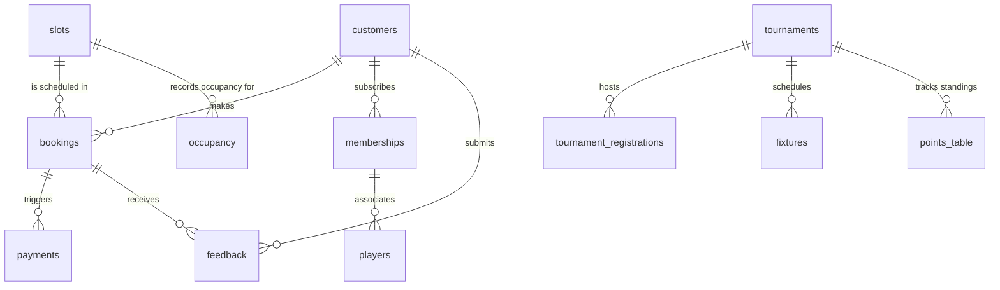

# 🏏 Eagle Box Cricket Slot Booking System

A premium, full-stack web application designed for **Eagle Box Cricket** to automate their slot bookings, tournament registrations, memberships, and admin management. Built with a highly optimized React frontend and a robust Node.js/Express backend powered by MySQL.

---

## 🚀 Key Architectural Concepts Used

This project was built from scratch with best practices in full-stack web development. The core concepts applied in this project include:

### 1. Model-View-Controller (MVC) Design Pattern
The backend structure follows the MVC pattern to separate concerns and ensure maintainability:
- **Models/Database**: Raw MySQL tables, relations, and schemas defined in SQL.
- **Controllers**: Modules containing the business logic (processing inputs, calling databases, returning JSON responses).
- **Routes/Views**: RESTful API endpoints that route requests to their respective controllers, while the React frontend acts as the view layer rendering the data dynamically.

### 2. Relational Database Design & Data Integrity
A fully normalized MySQL schema containing **12 tables** governs the system. It enforces:
- **Foreign Key Constraints** to link customers, slots, bookings, payments, and tournaments.
- **Enumerations (ENUM)** to enforce strict state control (e.g., Slot statuses: `available`, `booked`, `blocked`; Payment statuses: `pending`, `paid`, `failed`).
- **Database Indexing & Keys** to guarantee quick query retrieval (e.g., unique constraints on customer phone numbers).

### 3. ACID-Compliant Database Transactions
For critical operations like creating a booking, the system utilizes **MySQL Database Transactions** (`START TRANSACTION`, `COMMIT`, `ROLLBACK`) via the `mysql2/promise` library. This ensures that:
1. A customer record is verified or created.
2. The slot availability is checked and locked.
3. The booking record is created.
4. The slot status is updated to `booked`.
5. The payment ledger is populated.
If any step fails, the entire sequence is rolled back to prevent orphaned bookings or double bookings.

### 4. Connection Pooling
Instead of opening and closing database connections for every HTTP request (which is highly inefficient), a **MySQL Connection Pool** is initialized. This pool keeps a set of connections open, recycling them for active queries, improving API response times, and preventing database server resource exhaustion.

### 5. Client-Side State Management (React Context API)
To manage global states (like Admin authentication session) without adding heavy, complex third-party tools like Redux, the frontend uses the **React Context API**. The `AuthContext` provides:
- Session persistence.
- Admin login / logout logic.
- Route blocking mechanisms.

### 6. Protected Client-Side Routing
Secure paths (Admin Dashboard, Slot Management, Tournaments, Memberships, Reports) are guarded using a custom React component `<ProtectedRoute>`. It inspects the `AuthContext` state and redirects unauthenticated users to the `/admin/login` page, preserving security on the client side.

### 7. Process-Level Exception Handling
To ensure high availability and prevent the backend server from crashing on unexpected database failures or uncaught errors, custom process-level error guards are registered at the entry point (`server.js`):
- `unhandledRejection`: Captures failed database connections or rejected promises.
- `uncaughtException`: Safeguards against general runtime syntax/reference errors.

---

## 🛠️ Technology Stack

| Component | Technology | Description |
| :--- | :--- | :--- |
| **Frontend** | **React.js 18** | A component-based UI library with efficient Virtual DOM rendering. |
| **Build Tool** | **Vite** | An ultra-fast development server with Hot Module Replacement (HMR). |
| **Styling** | **Tailwind CSS** | A utility-first CSS framework for custom responsive styling. |
| **UI Components** | **Radix UI / shadcn/ui** | Accessible, custom-styled primitives (Dialogs, Selects, Toasts). |
| **Icons** | **Lucide React** | Clean, customizable vector icons. |
| **HTTP Client** | **Axios** | Promised-based client to communicate with the REST API. |
| **Routing** | **React Router DOM v6** | Client-side routing with nested layouts and protected guards. |
| **Backend** | **Node.js / Express.js** | Fast, lightweight backend framework with MVC routing. |
| **Database** | **MySQL** | Reliable relational database with robust transactional capabilities. |
| **DB Client** | **mysql2/promise** | Pure JavaScript MySQL client supporting Promises/Async-Await. |

---

## 📁 Repository Structure

```
BOX CRICKET INTERNSHIP/
├── backend/
│   ├── config/
│   │   └── db.js            # MySQL database pool configuration
│   ├── controllers/         # Business logic for slots, bookings, dashboard, etc.
│   ├── database/
│   │   └── schema.sql       # Database table definitions and seed data
│   ├── routes/              # Express routers for API resources
│   ├── .env.example         # Example environment file
│   ├── server.js            # Backend entry point
│   └── package.json
└── frontend/
    ├── public/              # Static assets
    ├── src/
    │   ├── components/      # Reusable components (Navbar, Modal, Spinner, etc.)
    │   ├── context/
    │   │   └── AuthContext.jsx # Global Admin state provider
    │   ├── pages/           # Public & Admin pages (15 total)
    │   │   ├── admin/       # Secured Admin-specific pages
    │   │   └── ...          # Public pages (Home, FAQ, Book Slot, My Bookings)
    │   ├── App.jsx          # Route declarations
    │   ├── config.js        # API Base URL configuration
    │   └── index.css        # Tailwind directives and custom themes
    ├── tailwind.config.js
    ├── vite.config.js
    └── package.json
```

---

## 🗄️ Database Schema (12 Tables)

The database schema is fully documented below. It is designed to handle users, schedules, transactions, tournaments, memberships, fixtures, and analytics.



### Detailed Table Definitions
1. **`customers`**: Stores basic info, email, and whether they are standard `player`, `team`, or `corporate` entity.
2. **`slots`**: Manages hourly play times, rates, and states (`available`, `booked`, `blocked`).
3. **`bookings`**: Connects a customer to a slot, detailing player counts, total amount, and booking/payment status.
4. **`payments`**: Records billing method (`cash`, `upi`, `card`), status, and timestamp.
5. **`tournaments`**: Defines tournaments, registration price limits, dates, and progression status.
6. **`tournament_registrations`**: Registers teams, team captains, and checks payment status.
7. **`memberships`**: Handles monthly plans (`basic`, `premium`, `corporate`), prices, and active durations.
8. **`players`**: Lists individual players linked to active memberships or corporate groups.
9. **`fixtures`**: Matches created for tournaments with status, scheduled time, and final scores.
10. **`points_table`**: Dynamically computed rankings (wins, losses, points) per tournament.
11. **`occupancy`**: Tracks historic usage and direct slot revenue for dashboard reporting.
12. **`feedback`**: Captures rating values (1 to 5) and textual customer reviews.

---

## 📡 API Endpoint Documentation

All endpoints receive and return JSON. The API is prefixed with `/api`.

### 1. Slots (`/api/slots`)
- `GET /api/slots?date=YYYY-MM-DD` - Retrieve slots for a specific date.
- `POST /api/slots` - Create a new slot (Admin).
- `PUT /api/slots/:id` - Edit slot duration, price, or status (Admin).
- `DELETE /api/slots/:id` - Delete a slot (Admin).

### 2. Bookings (`/api/bookings`)
- `GET /api/bookings` - Retrieve list of bookings (Admin).
- `GET /api/bookings/:id` - Get specific booking detail (Admin).
- `GET /api/bookings/phone/:phone` - Search and list customer bookings via phone number.
- `POST /api/bookings` - Create a new booking (Transactional: registers/updates customer, checks availability, creates booking, updates slot status).
- `PUT /api/bookings/:id/status` - Modify status (`confirmed`, `cancelled`, `pending`).
- `PUT /api/bookings/:id/payment` - Update payment state (`pending`, `paid`, `failed`).

### 3. Tournaments & Fixtures (`/api/tournaments` & `/api/fixtures`)
- `GET /api/tournaments` - Fetch all active and past tournaments.
- `POST /api/tournaments` - Launch new tournament (Admin).
- `PUT /api/tournaments/:id` - Edit tournament details (Admin).
- `GET /api/tournaments/:id/registrations` - Fetch registered teams.
- `POST /api/tournaments/:id/register` - Submit a new team registration.
- `GET /api/tournaments/:id/fixtures` - Get match matchups.
- `POST /api/fixtures` - Schedule a match between two teams.
- `PUT /api/fixtures/:id` - Update match state, scores, or results.
- `GET /api/tournaments/:id/points` - Fetch Points Table standings.

### 4. Memberships (`/api/memberships`)
- `GET /api/memberships` - List memberships.
- `POST /api/memberships` - Purchase a membership subscription.
- `PUT /api/memberships/:id` - Update membership plan status.

### 5. Dashboard (`/api/dashboard`)
- `GET /api/dashboard/summary` - Computes financial and operational summary (Revenue, Occupied slots, active memberships, reviews, sales chart metrics).

---

## 🎨 Color Palette & UI Guidelines

To maintain brand consistency, the following visual system is strictly enforced across the frontend Tailwind utility layout:
* 🟢 **Primary (Dark Green)**: `#1a5c2a` (representing the grass/turf theme)
* 🟡 **Secondary (Gold)**: `#f5a623` (used for highlight tags, CTA buttons)
* ⚪ **Background**: `#f9f9f9`
* ⚫ **Text (Charcoal)**: `#1a1a1a`
* ✅ **Success**: `#16a34a`
* ❌ **Error**: `#dc2626`

---

## ⚙️ Setup and Run Instructions

Follow these instructions to run the application locally:

### Prerequisites
- Node.js (v16.0.0 or higher)
- MySQL Server installed and running

### 1. Database Setup
1. Open your MySQL command client or tool (like Workbench/phpMyAdmin).
2. Create the database and seed tables:
   ```sql
   SOURCE backend/database/schema.sql;
   ```

### 2. Backend Configuration
1. Navigate to the backend folder:
   ```bash
   cd backend
   ```
2. Install dependencies:
   ```bash
   npm install
   ```
3. Create a `.env` file in the `backend` directory (do not commit this):
   ```env
   PORT=5000
   DB_HOST=localhost
   DB_USER=your_mysql_username
   DB_PASSWORD=your_mysql_password
   DB_NAME=eagle_box_cricket
   ```
4. Start the server (Development mode with automatic reload):
   ```bash
   npm run dev
   ```
   The backend will run on `http://localhost:5000`.

### 3. Frontend Configuration
1. Open a new terminal and navigate to the frontend folder:
   ```bash
   cd frontend
   ```
2. Install dependencies:
   ```bash
   npm install
   ```
3. Verify the API connection URL in `frontend/src/config.js` is correct:
   ```javascript
   export const API_URL = 'http://localhost:5000/api';
   ```
4. Start the Vite development server:
   ```bash
   npm run dev
   ```
   The application will launch on `http://localhost:5173`. Open this URL in your web browser.

---

## 🔒 Administrative Credentials
To access the secured Admin panel (`/admin/dashboard`):
* **Username**: `eagleadmin`
* **Password**: `eagle@123`

---

## 📝 License
This project is for educational/internship evaluation purposes. All rights reserved.
